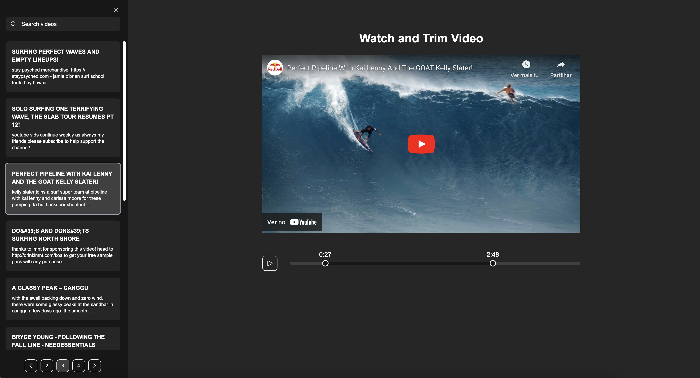

# Youtube Dashboard



## Getting Started

```bash
#dev
npm run install
npm run dev

#prod
npm run build
npm run start

```

Open [http://localhost:3000](http://localhost:3000) with your browser to see the result.
